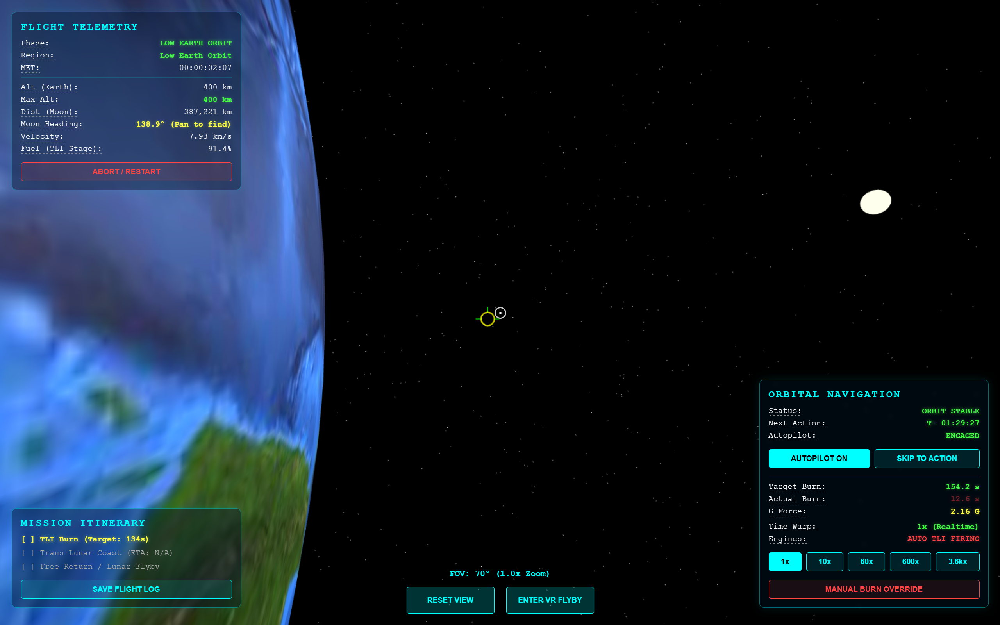
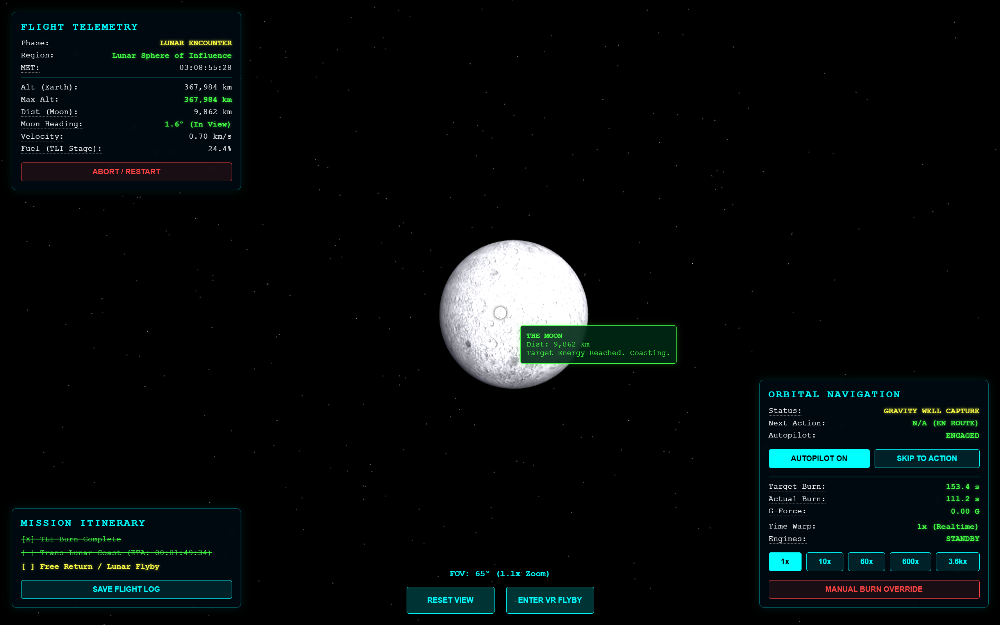
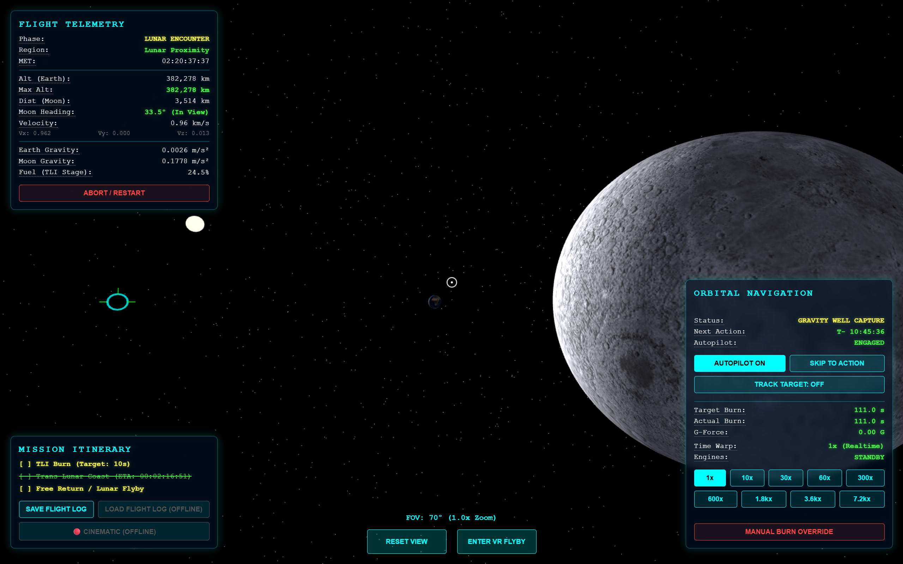
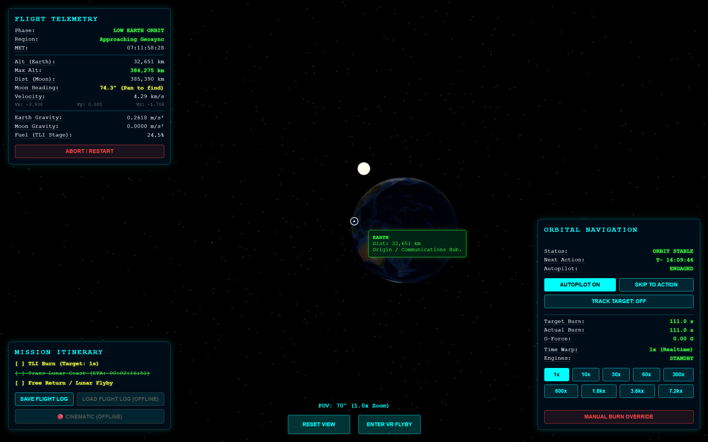
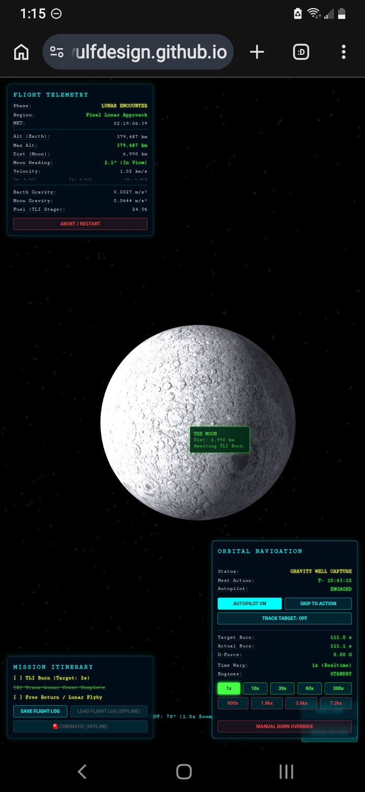
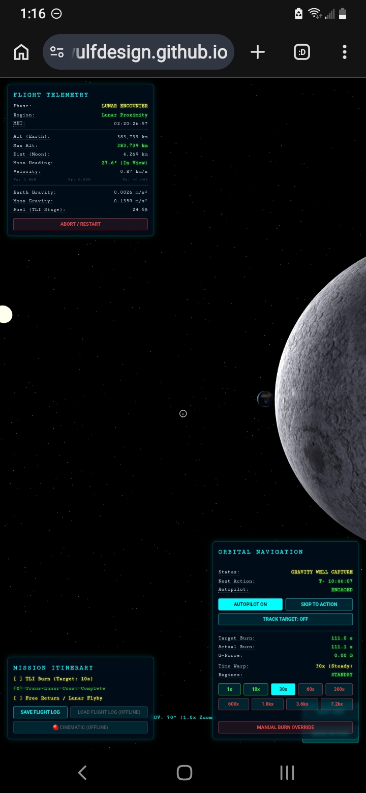
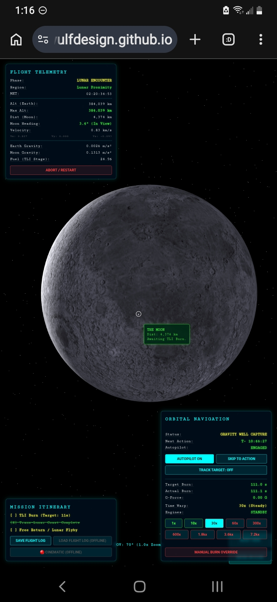
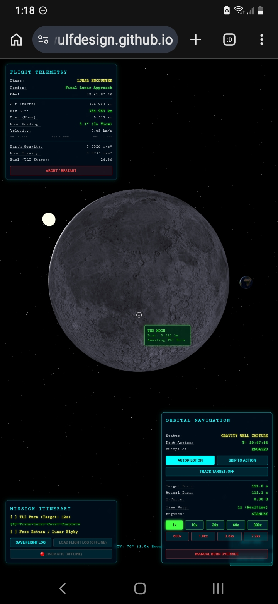

# **Artemis: The Free Return (WebXR Orbital Sandbox)**

**A browser-based, educational gravity and orbital dynamics simulator built with Three.js and WebXR.**

### **🚀 [Launch Live Experience](https://wulfdesign.github.io/lunar-flyby-xr/)**

*(No installation required. Works in modern browsers and WebXR-compatible VR headsets.)*

*Initial Burn toward the Moon from Low Earth Orbit.*

*Arriving at the Moon after a 3-day cislunar coast.*

*Aligning the Earth, Sun, and Moon during the flyby.*

*Approaching Earth on the return trajectory.*

> **🚀 Current Status (v1.9.7):** The simulation has achieved a fully validated Lunar Flyby and Earth Return capability! The physics engine now utilizes distance-based Waypoints and a Mid-Course Correction (MCC) framework to execute leading-edge intercepts without needing "God-Mode" cheats. Current development is focused on End-of-Mission sequences: Earth return, atmospheric re-entry heating, and parachute splashdown mechanics.

## **🚀 The Vision**

*Artemis: The Free Return* was conceived to make orbital mechanics accessible, intuitive, and awe-inspiring without intimidating the user with complex mathematics.

Originally inspired by a proposal for the now-canceled *dearMoon* project and timed to celebrate NASA's historic Artemis missions, this project places everyday people in the commander's seat of a spacecraft in Low Earth Orbit (LEO). It proves that you don't need a multi-billion dollar budget to reach the stars—you just need curiosity and a browser.

## **🛠️ Features**

This isn't a pre-rendered animation; it's a living physics sandbox.

* **Real Newtonian Physics:** Powered by a custom Velocity Verlet integration engine using real-world units (kilometers, kilograms, seconds) and true N-body gravity (Earth and Moon).  
* **Orbital Energy Targeting:** The flight computer calculates Trans-Lunar Injection (TLI) burns using the Vis-viva equation and orbital energy, not just preset timers.  
* **Dynamic Telemetry HUD:** Real-time G-Force, relative velocity, altitude, and fuel mass-flow calculations.  
* **Time Warp System:** Accelerate time up to 3,600x to cross the 3-day cislunar gap.  
* **WebXR Support:** Instantly jump into an immersive VR headset view directly from the browser (Still needs testing & QA on stand alone quest standalone headsets, however it did work on the Quest 3 link when lauched from browser on vr ready pc. STILL NEEDS QA & TESTING).  
* **Flight Data Logging:** Export your mission telemetry to a .json file for post-flight analysis.

## **🛠️ Tech Stack & Architecture**

* **Engine:** Three.js (r128)
* **Physics:** Custom Velocity Verlet Integration
* **Frontend:** Vanilla HTML5/CSS3 (No Tailwind/Bootstrap)
* **Immersion:** WebXR API (VR Support)

## **⭐ Scientific & Technical Credits**

* **NASA Artemis Program & SVS:** Official telemetry targeting frameworks and the CGI Moon Kit references.
* **Three.js Ecosystem:** Thanks to the open-source contributors (like `mrdoob` and `three-globe`) for providing the core rendering framework and high-resolution Earth/Moon textures.

## **🌌 Legacy & Inspiration**

* **The dearMoon Project:** Acknowledging the private lunar mission proposal that served as the initial spark for this simulation 8 years ago.
* **Charles Pooley (MicroLaunchers) & John Carmack (Armadillo Aerospace):** Championing the "PC Era" of space and inspiring the agile, hacker-coder approach to rocketry—proving that rapid iteration and available tools outpace billion-dollar budgets.
* **The RepRap & DIYbio Maker Communities:** Acknowledging that the open-source hardware ethos is the exact mindset needed to democratize space exploration.
* **UpLiftVR Studios:** Setting the standard for what a public VR exhibition installation could feel like with pieces such as [*High Desert Eclipse* (2017)](https://youtu.be/fzcFw_33iC8) and the SIFF VR Zone [*Maiden Flight* (2018)](https://youtu.be/FHIc24WiViY).

*(For a full breakdown of resources and data links, see the detailed [🎖️ Credits & Resources](docs/credits.md) document).*

## **📜 History**

This project began as an AI-assisted rapid prototype session on March 30-31, 2026. After a successful iteration process, the source code was rescued from a browser canvas glitch and reconstructed into this repository to serve as a foundation for further development of educational space simulations.

## **💻 How to Run**

This project is currently completely self-contained in a single file for maximum accessibility.

1. Clone or download this repository.  
2. Double-click index.html to open it in any modern web browser.  
3. (Optional) Put on a WebXR-compatible headset (like the Meta Quest) and click "ENTER VR FLYBY".
4. **📱 Mobile Devices:** The simulation runs successfully on mobile browsers, but **must remain locked to Portrait Mode**. We recently achieved a full lunar flyby entirely on a mobile device! However, be very careful with the high-warp buttons (like 7.2kx) during critical course corrections, as the touch UI layout currently places them close together. Rotating to landscape stretches the HUD bounds and will cause buttons to permanently overlap.

  
  
  
  

## **⭐ Attribution & Giving Credit**

If you use this project for your own research, education, or as a base for your own work, we'd love to see it!

* **Credit:** Please credit **Larry James (Wulf Design Studios / UpLiftVR Studios)** in any public-facing descriptions or presentations.
* **Tag Us:** Tag us on social media so we can share your progress with the community!
  * **LinkedIn:** [WulfDesignStudios](https://linkedin.com/in/WulfDesignStudios)
  * **YouTube:** [UpLiftVR Studios](https://www.youtube.com/@UpLiftVR)
* **Clone & Fork:** If you fork or clone this repository, please keep the attribution and license files intact.

## **🗺️ V2.0 Roadmap**

* \[ \] **Orbital Traffic Checkpoints:** Add altitude milestones indicating when the player passes through the orbits of the ISS, Starlink network, GPS satellites, or Geosynchronous orbit. Include ambient visual elements outside the window for scale context.

* \[ \] **Mobile UX Overhaul:** Design a dedicated, touch-friendly UI layout specifically for mobile browsers to prevent misclicks on critical time-warp buttons and fix landscape orientation clipping.
* \[ \] **Bug Investigation:** Time warp seems to halt/reset repeatedly when deep inside the Lunar Sphere of Influence. Need to refine the SOI trigger latch.  
* \[ \] **Mid-Course Correction (MCC):** Add an "Off Course Detected" warning and a "Recalculate Destination" button to execute a burn midway to the Moon if alignment drifts.  
* \[ \] **Trajectory Trails:** Render the actual path flown (white line) vs projected path (blue dotted line).  
* \[ \] **Overview Map:** A 3/4 top-down orthographic minimap overlay showing Earth, Moon, and ship position.  
* \[ \] **Post-Flight Report:** After flyby/crash, generate a UI report showing Max Gs, flight time, and fuel remaining.  
* \[ \] **Lagrangian Points (L1-L4):** Add invisible targets/markers to the raycaster for L1 (between Earth/Moon), L2 (behind Moon), etc.  
* \[ \] **Lunar Orbit Insertion (LOI):** Add capability to do a retrograde burn at perilune to establish Lunar Orbit instead of a Free Return.  
* \[ \] **Target Waypoint HUD Overlay:** Add a floating marker in 3D space that physically points at the Moon or Earth (DESTINATION VECTOR) so users can easily visually locate targets when they are perpendicular to travel velocity.
* \[ \] **RCS Attitude Control:** Allow the user to uncouple the hull from the Prograde vector and use Reaction Control Thrusters to manually rotate the spacecraft (Yaw, Pitch, Roll) to execute burns in any direction.
* \[ \] **Asset Upgrades:** Replace procedural geometry with high-res NASA .glb models for the Orion capsule and SLS.

## **🏆 Completed Ready to Archive**

## **👨‍🚀 About the Creator**

**Larry James (WulfDesignStudios / UpLiftVR Studios)** is an indie VR developer, filmmaker, and space enthusiast with a passion for using immersive technology to make complex science accessible and awe-inspiring.

### **🌑 Featured Project: High Desert Eclipse**

One of Larry's most impactful works is **"High Desert Eclipse,"** a 360-degree VR documentary capturing the majestic 2017 total solar eclipse from a remote hilltop in the Oregon high desert.

* **For Educators & Schools:** This experience is a powerful tool for Earth and Space science. It captures the eerie transition from day to twilight, the 360-degree "sunrise" on the horizon, and the breathtaking solar corona.
* **Watch for Free:** The 4K 360-degree timelapse is available on YouTube. **Tip:** For the best quality, especially in a VR headset, set the playback speed to **0.25x**. This allows the 4K stream to buffer smoothly and lets you soak in the subtle environmental changes.
  * [📺 Watch: High Desert Eclipse (YouTube)](https://youtu.be/fzcFw_33iC8)
* **Immersive Edition:** A full-length version is available for the **Meta Quest** (via App Lab) and on [upliftvr.itch.io](https://upliftvr.itch.io/). It's a perfect addition to classroom VR kits to bring a "once-in-a-lifetime" celestial event to students anywhere.

### **🚀 The Vision Behind Artemis: The Free Return**

This project represents a "lifetime vision finally fulfilled." Inspired by a proposal for the (now canceled) *dearMoon* project, it leverages the latest in WebXR and AI-assisted development to create a prototype that is "quicker and more accessible than ever before in history."

Larry's goal is to inspire the next generation of space explorers and to remind those who have seen a total eclipse of the magic—and for those who haven't, to provide the impetus to get into the path of the next one.

* [🎥 Evening Magazine Feature (UpLiftVR)](https://www.youtube.com/watch?v=Xh0l8hA9y0c)
* [🎬 FilmFreeway: Larry James](https://filmfreeway.com/LarryJames)
* [🔗 LinkedIn: WulfDesignStudios](https://linkedin.com/in/WulfDesignStudios)
