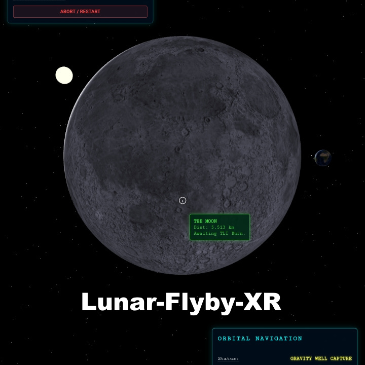
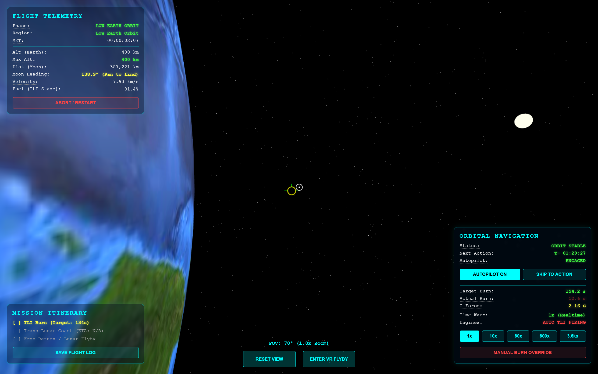
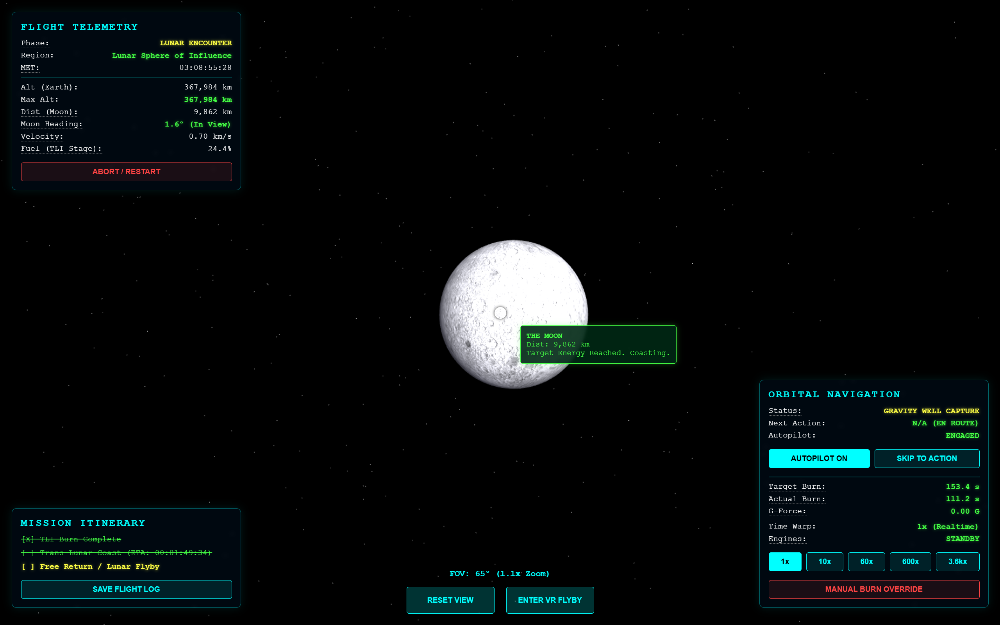
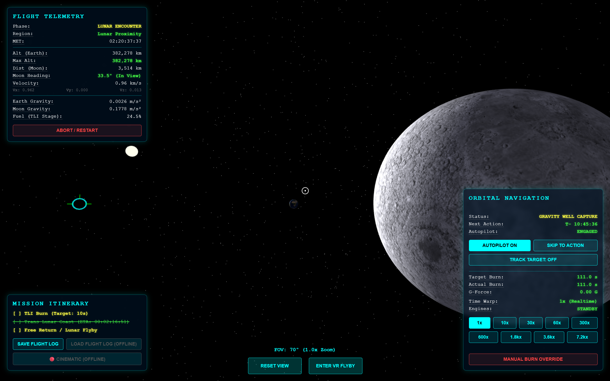
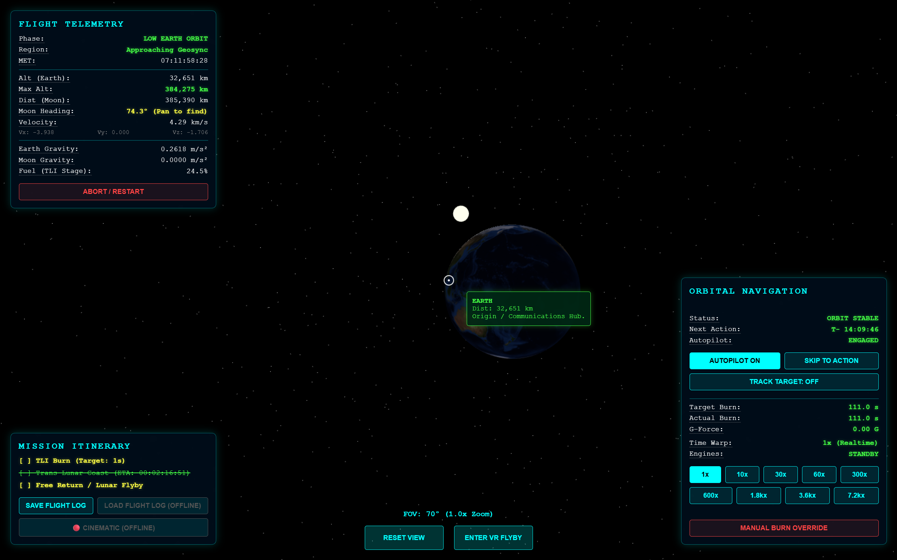
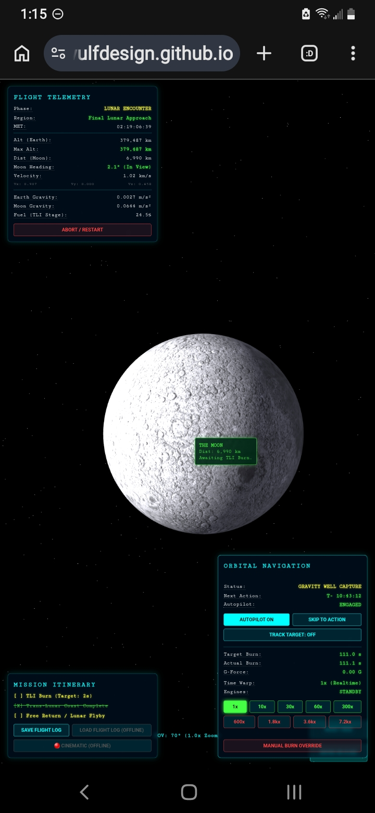
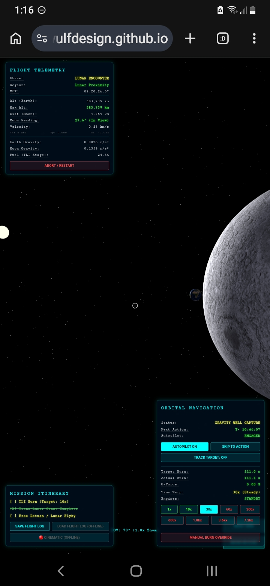
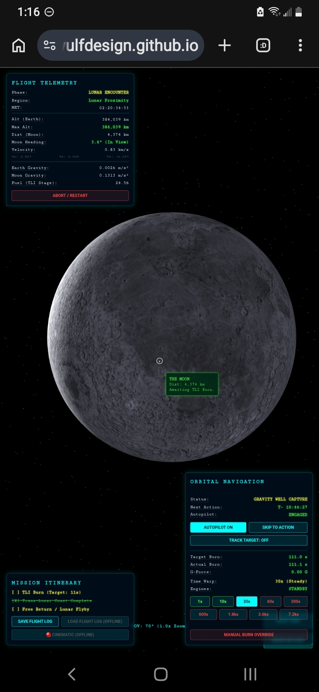
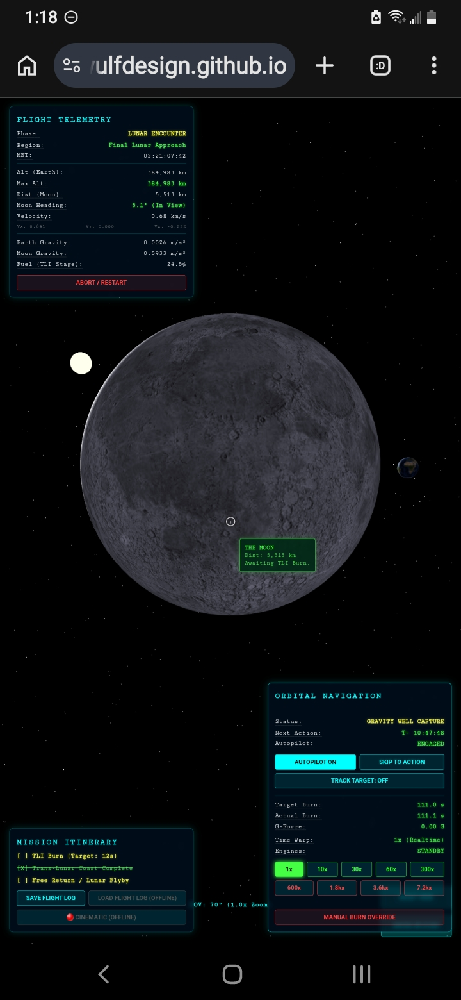
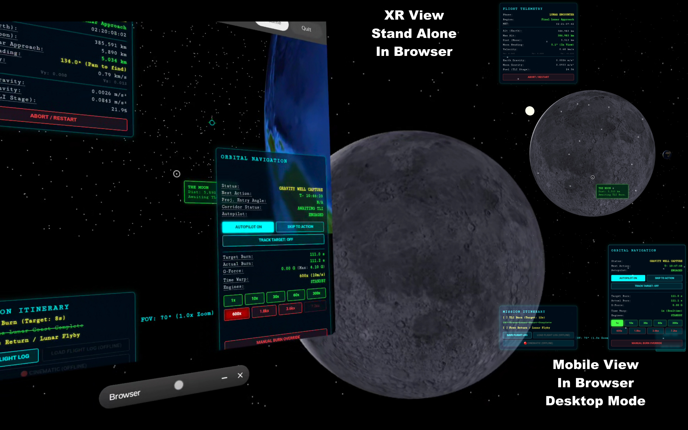

# **Artemis: The Free Return (WebXR Orbital Sandbox)**

**A browser-based, educational gravity and orbital dynamics simulator built with Three.js and WebXR.**

> Step into the commander's seat of a spacecraft in Low Earth Orbit. Calculate your Trans-Lunar Injection, coast across the cislunar void to gravitationally slingshot around the Moon, and make final trajectory adjustments to thread the needle on a fiery atmospheric reentry—all powered by real-time Newtonian N-body physics. Will you survive the free return?

### **🚀 [Launch Live Experience](https://wulfdesign.github.io/lunar-flyby-xr/)**

*(No installation required. Works in modern browsers and WebXR-compatible VR headsets.)*

---

## **🚀 The Vision**

*Artemis: The Free Return* was conceived to make orbital mechanics accessible, intuitive, and awe-inspiring without intimidating the user with complex mathematics.

Originally inspired by a proposal for the now-canceled *dearMoon* project and timed to celebrate NASA's historic Artemis missions, this project places everyday people in the commander's seat of a spacecraft in Low Earth Orbit (LEO). It proves that you don't need a multi-billion dollar budget to reach the stars—you just need curiosity and a browser.

## **🛠️ Features**

This isn't a pre-rendered animation; it's a living physics sandbox.

* **Real Newtonian Physics:** Powered by a custom Velocity Verlet integration engine using real-world units (kilometers, kilograms, seconds) and true N-body gravity (Earth and Moon). Unlike space visualizers that pull from pre-calculated JPL ephemeris data (moving the ship on "rails"), this engine calculates raw gravitational forces dynamically frame-by-frame.
* **Orbital Energy Targeting:** The flight computer calculates Trans-Lunar Injection (TLI) burns using the Vis-viva equation and orbital energy, not just preset timers.
* **True Trajectory Avionics:** Iterative targeting solver calculates exact transverse Delta-V for Mid-Course Corrections, displaying projected Entry Angles days before reaching Earth.
* **Active Aerodynamic Reentry:** Dynamic atmospheric drag modeling requiring you to thread a brutal 2-degree reentry keyhole to survive. Bank the capsule UP to generate lift and shallow your descent, or DOWN to dig into the atmosphere, managing lethal G-forces through the plasma blackout. 
* **Dynamic Telemetry HUD:** Real-time G-Force, relative velocity, altitude, orbital traffic checkpoints (ISS, Starlink, GPS), and fuel mass-flow calculations.  
* **Time Warp System:** Accelerate time up to 7,200x to cross the 3-day cislunar gap, with automated safety lockouts near gravitational bodies.  
* **WebXR Support:** Instantly jump into an immersive VR headset view directly from the browser (Tested on Quest 3 via PC Link).  
* **Flight Data Logging:** Export your mission telemetry to a .json file for post-flight analysis, including max G-force, minimum lunar distance, and parachute deployment timestamps.

---

## **📸 Mission Gallery**

| | |
| :---: | :---: |
|  *Initial Burn toward the Moon from Low Earth Orbit.* |  *Arriving at the Moon after a 3-day cislunar coast.* |
|  *Aligning the Earth, Sun, and Moon during the flyby.* |  *Approaching Earth on the return trajectory.* |

---

### **🎥 Watch the 8x Gameplay Timelapse**

  

*Inspired by the success of the historic Artemis II mission, this 2-minute timelapse condenses a full 17-minute flight from Trans-Lunar Injection to a precision splashdown on Earth. This isn't a scripted animation—the simulation is powered by real-time Newtonian N-body orbital mechanics and aerodynamic reentry physics built entirely in vanilla JavaScript and Three.js.*

> 🎤 **Exhibitions & Events:** I recently submitted this experience to the Seattle Indies Expo (SIX) and am actively exploring other tech/indie gaming events! If you're organizing an event and want a live WebXR physics simulation on the floor, reach out!

---

## **🛠️ Tech Stack & Architecture**

* **Engine:** Three.js (r128)
* **Physics:** Custom Velocity Verlet Integration
* **Performance:** Zero-allocation object pooling to eliminate JavaScript Garbage Collection lag during high-speed integration loops.
* **Frontend:** Vanilla HTML5/CSS3 (No Tailwind/Bootstrap)
* **Immersion:** WebXR API (VR Support)

## **⭐ Scientific & Technical Credits**

* **NASA Artemis Program & SVS:** Official telemetry targeting frameworks and the CGI Moon Kit references.
* **Three.js Ecosystem:** Thanks to the open-source contributors (like `mrdoob` and `three-globe`) for providing the core rendering framework and high-resolution Earth/Moon textures.

## **🌌 Legacy & Inspiration**

* **The dearMoon Project:** Acknowledging the private lunar mission proposal that served as the initial spark for this simulation 8 years ago.
* **Charles Pooley (MicroLaunchers) & John Carmack (Armadillo Aerospace):** Championing the "PC Era" of space and inspiring the agile, hacker-coder approach to rocketry—proving that rapid iteration and available tools outpace billion-dollar budgets.
* **The RepRap & DIYbio Maker Communities:** Acknowledging that the open-source hardware ethos is the exact mindset needed to democratize space exploration.
* **UpLiftVR Studios:** Setting the standard for what a public VR exhibition installation could feel like with pieces such as [*High Desert Eclipse* (2017)](https://youtu.be/fzcFw_33iC8) and the SIFF VR Zone [*Maiden Flight* (2018)](https://youtu.be/FHIc24WiViY).

*(For a full breakdown of resources and data links, see the detailed [🎖️ Credits & Resources](docs/credits.md) document).*

## **📜 History**

This project began as an AI-assisted rapid prototype session on March 30-31, 2026. After a successful iteration process, the source code was rescued from a browser canvas glitch and reconstructed into this repository to serve as a foundation for further development of educational space simulations.

## **💻 Platforms & Setup**

This project is currently completely self-contained in a single file for maximum accessibility.

### 🖥️ Desktop Browsers
1. Clone or download this repository.  
2. Double-click `index.html` to open it in any modern web browser (or run via a local server to bypass file-protocol CORS restrictions).  

> **🚀 Current Stable Release (v1.9.9.6):** Fully refactored the core HUD UI layout architecture into geometric corner Quadrants, optimizing the interface for squashed laptop un-maximized window frames so all text and telemetry scale flawlessly. 
> - **[Play Last Known Tested XR Version: v1.9.9.1](dev/index_v1.9.9.1.html)**
>
> 🧪 **Bleeding Edge Dev Sandboxes:**
> - [v1.9.9.2 (Educational Physics Reintegration)](dev/index_v1.9.9.2.html)

### 📱 Mobile Devices
The simulation runs successfully on mobile browsers, but **must remain locked to Portrait Mode**. We recently achieved a full lunar flyby entirely on a mobile device! Rotating to landscape stretches the HUD bounds and will cause buttons to permanently overlap.

> > [!WARNING]
> > **Mobile Users:** The v1.9.9.6 layout engine is currently optimized for Desktop and VR viewports. To experience the optimal UI layout on iOS/Android, please select **"Request Desktop Site"** in your mobile browser settings. Native responsive mobile support is currently actively tracked in the developer backlog.

| | | | |
| :---: | :---: | :---: | :---: |
|  |  |  |  |

### 🥽 WebXR (Meta Quest & Standalone VR)

*Executing a flawless standalone flight test directly inside the Meta Quest 3s using the native XR browser.*

*Artemis: The Free Return* was fundamentally built for immersion. Before treating exhibit guests at the Greenwood Art Show, we executed a flawless standalone flight test directly inside the **Meta Quest 3s** headset using its native XR browser.

Once launched, simply click the "ENTER VR FLYBY" button to step inside the capsule. We were able to ride through atmospheric re-entry, drogue parachute deployment, and successful ocean splashdown from the commander's seat!

> **⚠️ XR UI Notice:** The 3D physics engine is perfectly stable in VR, but the UI HUD requires a workaround. To operate the ship controls, you must pull up a separate floating browser window alongside the immersive VR view. A dedicated Mobile XR UI overhaul and detailed configuration instructions are coming in V2.0. *(Also full instructions, in-headset screenshots, and captured video to come).*

## **⭐ Attribution & Giving Credit**

If you use this project for your own research, education, or as a base for your own work, we'd love to see it!

* **Credit:** Please credit **Larry James (Wulf Design Studios / UpLiftVR Studios)** in any public-facing descriptions or presentations.
* **Tag Us:** Tag us on social media so we can share your progress with the community!
  * **LinkedIn:** [WulfDesignStudios](https://linkedin.com/in/WulfDesignStudios)
  * **YouTube:** [UpLiftVR Studios](https://www.youtube.com/@UpLiftVR)
* **Clone & Fork:** If you fork or clone this repository, please keep the attribution and license files intact.

## **🗺️ V2.0 Roadmap**

* \[ \] **Mobile UX Overhaul:** Design a dedicated, touch-friendly UI layout specifically for mobile browsers to prevent misclicks on critical time-warp buttons and fix landscape orientation clipping.
* \[ \] **Bug Investigation:** Time warp seems to halt/reset repeatedly when deep inside the Lunar Sphere of Influence. Need to refine the SOI trigger latch.  
* \[ \] **Trajectory Trails:** Render the actual path flown (white line) vs projected path (blue dotted line).  
* \[ \] **Overview Map:** A 3/4 top-down orthographic minimap overlay showing Earth, Moon, and ship position.  
* \[ \] **Lagrangian Points (L1-L4):** Add invisible targets/markers to the raycaster for L1 (between Earth/Moon), L2 (behind Moon), etc.  
* \[ \] **Lunar Orbit Insertion (LOI):** Add capability to do a retrograde burn at perilune to establish Lunar Orbit instead of a Free Return.  
* \[ \] **Target Waypoint HUD Overlay:** Add a floating marker in 3D space that physically points at the Moon or Earth (DESTINATION VECTOR) so users can easily visually locate targets when they are perpendicular to travel velocity.
* \[ \] **RCS Attitude Control:** Allow the user to uncouple the hull from the Prograde vector and use Reaction Control Thrusters to manually rotate the spacecraft (Yaw, Pitch, Roll) to execute burns in any direction.
* \[ \] **Asset Upgrades:** Replace procedural geometry with high-res NASA .glb models for the Orion capsule and SLS.

## **🏆 Completed Ready to Archive**
* [x] **Active Reentry & Aerodynamics:** Implemented Lift/Drag bank vectors, parachute reefing, and plasma visual effects.
* [x] **True MCC Trajectory Alignment:** Replaced static delta-v bumps with an iterative targeting solver to perfectly calculate Earth entry angle.
* [x] **Orbital Traffic Checkpoints:** Added HUD warnings for crossing ISS, Starlink, and GPS orbital planes.

## **🌌 Overview & Director's Cut**

> *"What does it truly feel like to leave Earth behind? Pointing toward the second star to the left, take the controls of Artemis II in Low Earth Orbit and unleash 111 seconds of thunderous Trans-Lunar Injection burn to drift across the silent cislunar void. With most of your propellant spent, the only thing standing between you and the cold oblivion of deep space are a few critical midcourse corrections to thread the needle for a gravitational slingshot around the Moon and safely return to Earth.
> 
> Experience the awe of deep space as the Moon swells to fill your entire field of view—and feel your stomach drop as its colossal gravity well grabs your ship on close approach, hurtling you around the lunar far side. As Earth vanishes behind the cratered horizon and total radio blackout falls, you realize that everything humanity has ever been is hundreds of thousands of miles away... and you can only hope the math is right to sling you back toward the only home we've ever known at 25,000 mph.
> 
> With unscripted Newtonian physics, final trajectory adjustments, and active aerodynamic lift-banking standing between you and disaster, you must thread a razor-thin 2-degree reentry keyhole through scorching atmospheric plasma. Far more than just a simulation, it becomes an awe-inspiring, heart-pounding WebXR journey among the stars."*

---

## **👨‍🚀 Director Biography**

**Larry James** is an independent VR director, creative technologist, and systems architect based in Seattle, Washington. As the founder of UpLiftVR Studios, Wulf Design Studios, & VRMakerDome, he harnesses spatial computing, browser-native WebXR, and real-time physics to make complex science and cosmic wonder universally accessible.

With over two decades of systems engineering experience, Larry fuses technical rigor with deeply humanistic storytelling. His previous works include ***High Desert Eclipse***, an acclaimed 4K 360° total solar eclipse documentary on the Meta Quest Store, and ***Maiden Flight***, a whimsical aerial VR installation showcased at the SIFF VR-Zone, praised by the *Seattle Times* and featured on *KING 5 Evening Magazine*.

Inspired by the historic NASA Artemis missions and a lifelong passion for space exploration, Larry created ***Artemis: The Free Return*** as a solo developer to prove that humanity's greatest orbital voyages don't require billion-dollar budgets to experience—just curiosity and an open web browser. His work bridges interactive aerospace science, festival curation, and indie creative coding.

---

## **📜 Director's Statement**

> *"For as long as I can remember, I have looked up at the Moon and dreamed of what it feels like to leave Earth behind. When the private dearMoon lunar mission was canceled, I felt a deep ache—not just for myself, but for the millions of dreamers who yearn to experience deep space. I realized that if the doors to commercial lunar flight were closing, I had to open a new one through code.
> 
> I built 'Artemis: The Free Return' to place everyday people in the commander's seat. I refused to put the spacecraft on pre-baked animation rails; the universe doesn't have rails. By calculating dynamic Newtonian gravity and active aerodynamic drag in real time, the simulation honors the true danger, math, and silent awe of cislunar flight. When you watch our fragile blue world vanish behind the lunar limb, my hope is that you feel both the terror of the void and the profound realization that we are all travelers on the same small island in the dark."*

---

### **🌑 Featured Works & Festival Links**

* 🎬 **[FilmFreeway: Artemis (Lunar Flyby XR) Project Page](https://filmfreeway.com/Lunar-Flyby-XR)**
* 🎬 **[FilmFreeway: Larry James Creator Profile](https://filmfreeway.com/LarryJames)**
* 🥽 **[FilmFreeway: KremFest XR 2026 Official Selection Submission](https://filmfreeway.com/kremfest)**
* 🚀 **[Launch Live WebXR Experience](https://wulfdesign.github.io/lunar-flyby-xr/)**
* 🎥 **[Watch 8x Gameplay Timelapse (YouTube)](https://youtu.be/bdHbIKcqRBs)**
* ☀️ **[Watch: High Desert Eclipse (YouTube 360)](https://youtu.be/fzcFw_33iC8)**
* 🎥 **[KING 5 Evening Magazine Feature (UpLiftVR)](https://www.youtube.com/watch?v=Xh0l8hA9y0c)**
* 🔗 **[LinkedIn: WulfDesignStudios](https://linkedin.com/in/WulfDesignStudios)**
* 🎮 **[Itch.io: UpLiftVR](https://upliftvr.itch.io)**